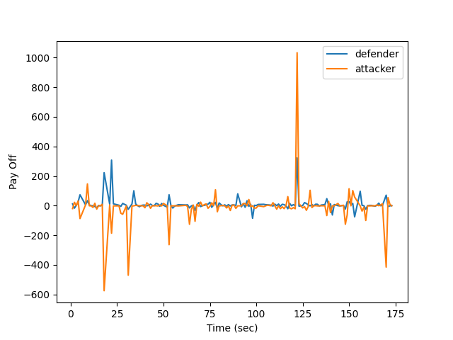
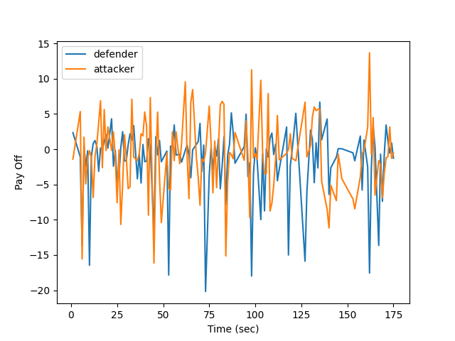
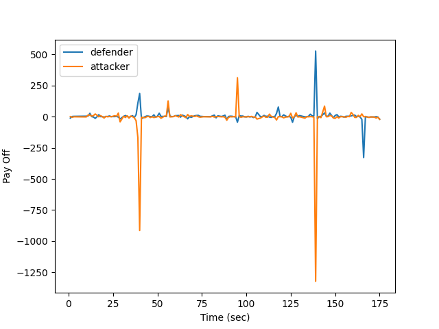
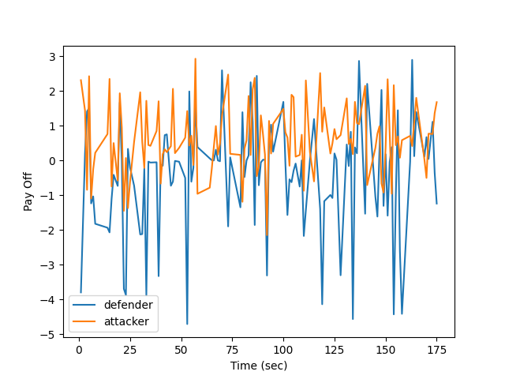
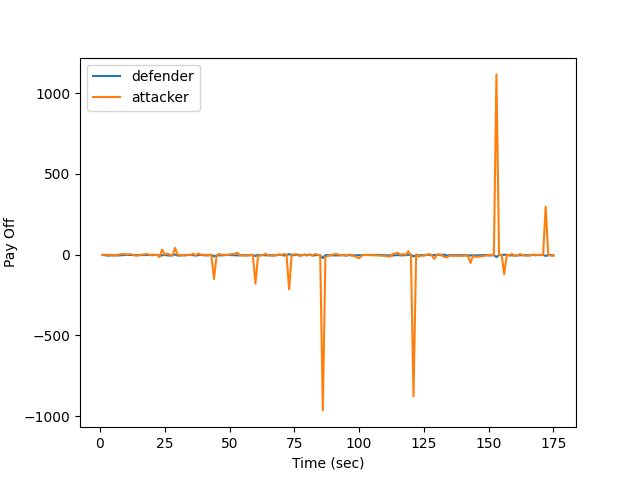
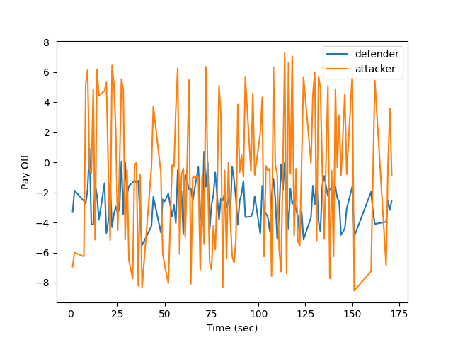

# GTM-CSec仿真
本仓库由甄五四、刘涛、梁浩哲基于SCI二区论文“GTM-CSec: Game theoretic model for cloud security based on IDS and honeypot”合作完成的博弈仿真实验。
论文链接：https://www.sciencedirect.com/science/article/pii/S0167404820300195
## 使用方法：
* 环境要求：windows 10，python==3.10.0
* 安装依赖项:
    - `pip install -r requirements.txt`
* 运行脚本:
    - `python simulation.py`

* 注意：我们的仿真结果数据保存simulation_results文件夹中，检查结果保存到images文件夹中

## 我们的仿真可视化结果:

1) Case 2: 

2) Case 3: 

3) Case 4: 

4) Case 5: 

5) Case 6: 

6) Case 7: 

* 由于基于随机数的仿真结果，每次运行均会不同，但攻击者和防御者pay off趋势是相同的。如果你想得到我们的检查结果你可以直接运行
    - `python plt.py`
    
### 如有错误，感谢您的批评指正。
